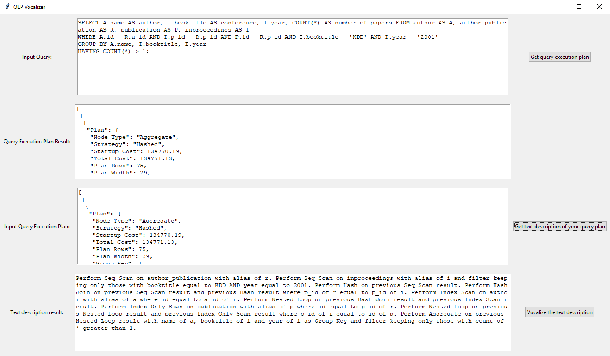

# pgvocalizer
Vocalizer for Postgres query plan

### Installation
*Tested on Windows 10 and Python 3.6* 
1. Install the pip requirements
```bash
$ pip install -r requirements.txt 
```
2. Edit the `.env` file and fill in all of database connection details
3.  Run `ui.py`
```bash
$ python ui.py
```

### Usage

- **Input Query**: You can input your query here to generate the QEP in JSON format
- **Query Execution Plan Result**: The QEP in JSON format from query above will be displayed here
- **Input Query Execution Plan**: Input the QEP in JSON format here, you can copy paste from the **Query Execution Plan Result** *OR* get it from querying Postgres using:
```sql
EXPLAIN (FORMAT JSON) [your_query_here]
```
- **Text description result**: The natural language translated of the QEP is displayed here.